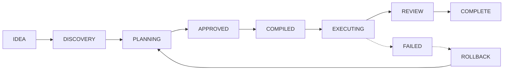

# APEX — Autonomous Planning and Execution eXchange

<div align="center">

[](https://opensource.org/licenses/MIT)
[](https://nodejs.org/)
[](https://github.com/anomalyco/apex)

**APEX** is a production-grade, dual-mode orchestration framework for [OpenCode CLI](https://opencode.ai). It bridges the gap between intelligent planning and secure, reliable execution using a rigorous state machine architecture.

[Features](#features) • [Architecture](#architecture) • [Quick Start](#quick-start) • [Development](#development)

</div>

## 🚀 About APEX

APEX (Autonomous Planning and Execution eXchange) transforms how AI agents interact with codebases. By decoupling discovery/planning from execution/governance, APEX ensures that AI-driven development remains safe, predictable, and maintainable.

---

## ✨ Design Principles

APEX is built on five core pillars:

1.  **No Execution Without Compilation:** A hard boundary between planning and execution; compiled plans are immutable JSON.
2.  **Interactive Planning Only:** The Brain handles questioning and design, while the Engine handles autonomous execution.
3.  **Profile Isolation:** Each operating mode has dedicated capabilities, skills, and permissions.
4.  **Context Efficiency:** Mandatory token preservation techniques.
5.  **Fail Closed:** Security governance dictates that in case of doubt, block, do not proceed.

---

## 🏗️ Architecture

APEX operates as a strict, state-machine-driven pipeline:



---

## ⚡ Quick Start

APEX runs as an OpenCode CLI plugin.

1. **Configure in OpenCode:**
   ```json
   {
     "plugin": ["@apex/cli"]
   }
   ```

2. **Execute:**
   ```bash
   /brainstorm "Add user authentication feature"
   ```

### Core Commands

| Command | Phase | Description |
| :--- | :--- | :--- |
| `/brainstorm` | `IDEA → DISCOVERY` | Initiate interactive discovery |
| `/spec` | `DISCOVERY → PLANNING` | Generate design specification |
| `/plan` | `PLANNING` | Decompose task & map dependencies |
| `/approve` | `PLANNING → APPROVED` | Freeze plan for execution |
| `/compile` | `APPROVED → COMPILED` | Compile plan to immutable JSON |
| `/run` | `COMPILED → EXECUTING` | Execute plan automatically |
| `/review` | `EXECUTING → REVIEW` | Run 3-stage security/code review |

---

## 🛠️ Development

### Prerequisites

*   Node.js >= 20.0.0
*   `pnpm` (recommended package manager)

### Installation & Commands

```bash
# Install dependencies
pnpm install

# Build all packages
pnpm build

# Run tests
pnpm test

# Lint code
pnpm lint
```

---

## 📦 Project Structure

```text
apex/
├── apps/cli/            # OpenCode CLI plugin
├── packages/
│   ├── types/           # Core Zod schemas and types
│   ├── orchestration/   # State machine engine
│   ├── brain/           # Planning & discovery agent
│   ├── compiler/        # Plan compilation
│   ├── engine/          # Automated TDD execution
│   └── ...              # (See packages for full list)
├── docs/                # Documentation
└── scripts/             # Build/dev scripts
```

---

## 📄 License

This project is licensed under the [MIT License](LICENSE).
