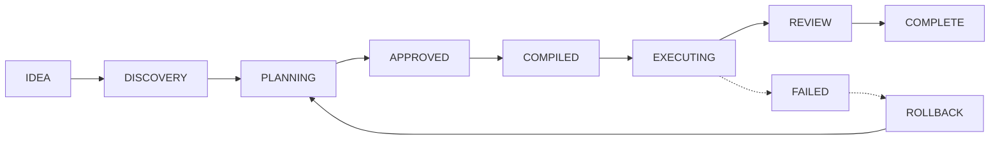

# APEX — Autonomous Planning and Execution eXchange

<div align="center">

[](https://opensource.org/licenses/MIT)
[](https://nodejs.org/)
[](https://github.com/anomalyco/apex)

**APEX** is a production-grade, dual-mode orchestration framework for [OpenCode CLI](https://opencode.ai). It bridges the gap between intelligent planning and secure, reliable execution using a rigorous state machine architecture.

[Features](#features) • [Architecture](#architecture) • [Quick Start](#quick-start) • [Development](#development)

</div>

## 🚀 About APEX

APEX (Autonomous Planning and Execution eXchange) transforms how AI agents interact with codebases. By decoupling discovery/planning from execution/governance, APEX ensures that AI-driven development remains safe, predictable, and maintainable.

---

## ✨ Design Principles

APEX is built on five core pillars:

1.  **No Execution Without Compilation:** A hard boundary between planning and execution; compiled plans are immutable JSON.
2.  **Interactive Planning Only:** The Brain handles questioning and design, while the Engine handles autonomous execution.
3.  **Profile Isolation:** Each operating mode has dedicated capabilities, skills, and permissions.
4.  **Context Efficiency:** Mandatory token preservation techniques.
5.  **Fail Closed:** Security governance dictates that in case of doubt, block, do not proceed.

---

## 🏗️ Architecture

APEX operates as a strict, state-machine-driven pipeline:



**Alternative Text Representation:**
`IDEA → DISCOVERY → PLANNING → APPROVED → COMPILED → EXECUTING → REVIEW → COMPLETE`
*(If Failed: → ROLLBACK → PLANNING)*

---

## ⚡ Quick Start & Installation

APEX is designed to be integrated seamlessly into your [OpenCode](https://opencode.ai) project.

### Installation (One-Command)

For the easiest setup, run the command for your operating system:

**macOS, Linux, and Windows (Git Bash/WSL):**
```bash
curl -sL https://raw.githubusercontent.com/ganjarsantoso/apex/main/scripts/install.sh | bash
```

**Windows (PowerShell):**
1. Download the installation script manually: [scripts/install.sh](scripts/install.sh)
2. Run it using Git Bash or WSL.

### Installation (Node.js/pnpm)

If you have [Node.js](https://nodejs.org/) installed, you can run APEX by cloning the repository and installing it locally:

```bash
# 1. Clone the repository
git clone https://github.com/ganjarsantoso/apex.git
cd apex

# 2. Install dependencies (requires pnpm)
pnpm install

# 3. Build the project
pnpm build
```
*(This is the recommended way to set up APEX for development and local usage.)*


---

### Uninstallation

To remove APEX from your project, delete the installation directory:

**macOS & Linux:**
```bash
rm -rf apex-framework
```

**Windows (PowerShell):**
```powershell
Remove-Item -Recurse -Force apex-framework
```
*(Also remember to remove the `@apex/cli` plugin entry from your `.opencode/opencode.json` file.)*


---

## 🌟 Advanced Features

Beyond the core lifecycle, APEX offers powerful capabilities for production-grade development:

- **Long-term Memory:** Utilizes a persistent knowledge graph (`@apex/memory-graph`) and semantic vector search (`@apex/semantic`) to remember project context across sessions.
- **Automated Retrospectives:** The `@apex/retrospective` package generates performance summaries and lesson extractions after tasks to improve future agent behavior.
- **Pattern Exchange:** Use the `@apex/patterns` format to export, validate, and share reusable architectural blueprints or workflow templates.
- **Checkpointing:** Use `/checkpoint` to save a snapshot of the execution state, allowing you to pause complex tasks and resume exactly where you left off.
- **Context Compression:** The `/compact` command manages context tokens intelligently, archiving completed tasks while preserving essential project state.
- **Model Router:** Dynamically selects the optimal LLM per task based on capability requirements (see configuration below).

## 🧠 Model Router Configuration

The model router (`@apex/model-router`) dynamically assigns the most suitable LLM model to each agent based on task complexity and agent role. It supports a hierarchical resolution strategy:

1. **Agent-specific override** (highest priority)
2. **Role-based override**
3. **Agent's preferred model**
4. **Default model**
5. **Fallback** (first available)

### Configuration File (`apex.config.json`)

Create a file named `apex.config.json` in your project root:

```json
{
  "defaultModel": "anthropic/claude-sonnet-4-5",
  "roleOverrides": {
    "planner": "anthropic/claude-opus-4-5",
    "coder": "anthropic/claude-sonnet-4-5",
    "reviewer": "anthropic/claude-opus-4-5",
    "security": "anthropic/claude-opus-4-5"
  },
  "agentOverrides": {
    "brain": "anthropic/claude-opus-4-5",
    "engine": "anthropic/claude-sonnet-4-5"
  }
}
```

**Configuration options:**

| Field | Type | Description |
| :--- | :--- | :--- |
| `defaultModel` | `string` | Base model used when no override matches |
| `roleOverrides` | `Record<string, string>` | Map of agent roles to specific models |
| `agentOverrides` | `Record<string, string>` | Map of specific agent IDs to specific models |

The router resolves models in this priority order: `agentOverrides` → `roleOverrides` → agent's `preferredModel` → `defaultModel` → first available model in the registry.


### Companion Skills

APEX works well with optional companion skills from [skills.sh](https://skills.sh/) — vendor-published skills that enhance specific phases. These are NOT bundled; install only what you need.

| Phase | Skill | Publisher | Benefit |
| :--- | :--- | :--- | :--- |
| DISCOVERY | `ask-questions-if-underspecified` | Trail of Bits | Helps Brain detect ambiguous objectives |
| PLANNING | `security-threat-model` | OpenAI | AppSec threat modeling before COMPILE |
| PLANNING | `plan-eng-review` | Garry Tan | Engineering-manager review of plan |
| EXECUTING | `property-based-testing` | Trail of Bits | Property-based testing in TDD loop |
| REVIEW | `differential-review` | Trail of Bits | Security-focused diff/PR review |

Install all at once:

```bash
pnpm setup-companion-skills
```

Or individually:

```bash
npx skills add trailofbits/skills@ask-questions-if-underspecified -g -y
npx skills add openai/skills@security-threat-model -g -y
npx skills add garytan/skills@plan-eng-review -g -y
npx skills add trailofbits/skills@property-based-testing -g -y
npx skills add trailofbits/skills@differential-review -g -y
```

> These skills are referenced in each [RuntimeProfile](./packages/types/src/profile.ts) under `companionSkills` so the orchestrator, CLI, and agents can suggest the right skill for the current phase.

### Core Commands

| Command | Phase | Description |
| :--- | :--- | :--- |
| `/brainstorm` | `IDEA → DISCOVERY` | Initiate interactive discovery |
| `/spec` | `DISCOVERY → PLANNING` | Generate design specification |
| `/plan` | `PLANNING` | Decompose task & map dependencies |
| `/approve` | `PLANNING → APPROVED` | Freeze plan for execution |
| `/compile` | `APPROVED → COMPILED` | Compile plan to immutable JSON |
| `/run` | `COMPILED → EXECUTING` | Execute plan automatically |
| `/review` | `EXECUTING → REVIEW` | Run 3-stage security/code review |

---

## 📖 Tutorial & Workflow

Mastering APEX requires embracing its strict state-machine lifecycle.

### Step-by-Step Guide

| Phase | Command | Mental Model |
| :--- | :--- | :--- |
| **Discover** | `/brainstorm` | "What are we doing, and why?" |
| **Spec** | `/spec` | "Write down exactly what to build." |
| **Decompose** | `/plan` | "How do we break this into small steps?" |
| **Lock-in** | `/approve` | "I confirm this plan is correct." |
| **Compile** | `/compile` | "Generate the immutable blueprint." |
| **Build** | `/run` | "Autonomous execution (TDD loops)." |
| **Verify** | `/review` | "Is it secure and high quality?" |

### Revision & Addition Policy

- **Planning Phase (Mutable):** During the `PLANNING` phase, you can iterate, re-order, or refine your plan as much as needed.
- **Approval Boundary (Immutable):** Once you issue `/approve`, the plan is locked. This ensures stable, predictable automated execution.
- **Adding Features:**
  - **Best Practice:** Complete the current lifecycle (`COMPLETE` state) before starting a new lifecycle for additional features. This keeps history clean.
  - **Emergency:** If an immediate change is required, you must trigger a `ROLLBACK` to return to the `PLANNING` phase or start a new lifecycle from scratch. Never attempt to manually edit an active, approved plan.


### Prerequisites

*   Node.js >= 20.0.0
*   `pnpm` (recommended package manager)

### Installation & Commands

```bash
# Install dependencies
pnpm install

# Build all packages
pnpm build

# Run tests
pnpm test

# Lint code
pnpm lint
```

---

## 📦 Project Structure

```text
apex/
├── apps/cli/            # OpenCode CLI plugin
├── packages/
│   ├── types/           # Core Zod schemas and types
│   ├── orchestration/   # State machine engine
│   ├── brain/           # Planning & discovery agent
│   ├── compiler/        # Plan compilation
│   ├── engine/          # Automated TDD execution
│   └── ...              # (See packages for full list)
├── docs/                # Documentation
└── scripts/             # Build/dev scripts
```

---

## 📄 License

This project is licensed under the [MIT License](LICENSE).
